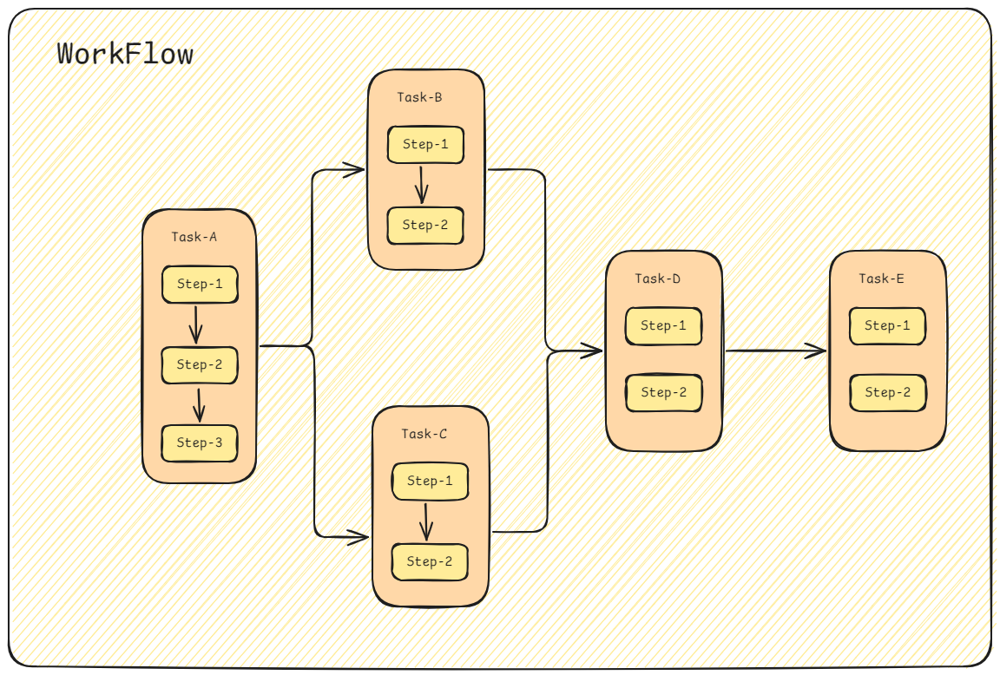

# workflow

Workflow是一个基于Kubernetes的工作流引擎和持续集成（CI）工具，它允许开发者以可视化和结构化的方式定义、管理和执行复杂的工作流程。在这个框架中，每个Task都被视为一个独立的Pod，而Pod是Kubernetes中用于封装容器化应用程序的基本单位。这意味着每个Task都可以拥有自己的资源配置、环境变量和存储需求，从而确保了任务间的隔离性和灵活性。

### Prerequisites
- go version v1.22.0+
- docker version 17.03+.
- kubectl version v1.11.3+.
- Access to a Kubernetes v1.11.3+ cluster.

### Web 

